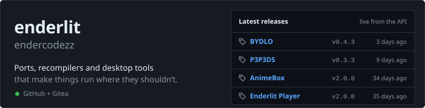
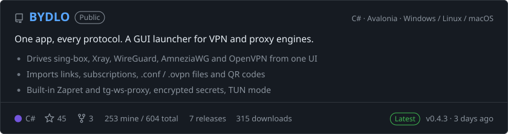
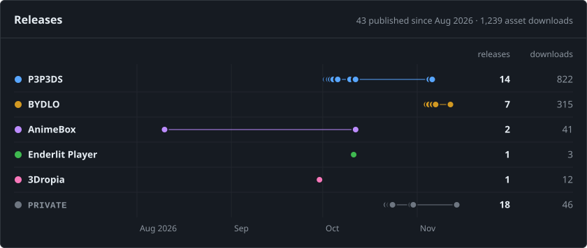
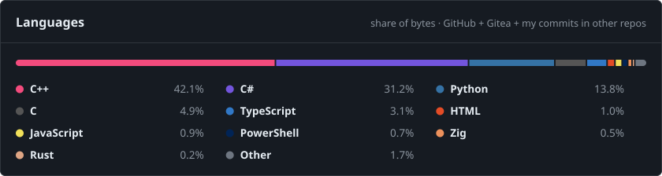

<a href="https://enderlit.com"><picture><source media="(prefers-color-scheme: dark)" srcset="assets/header-dark.4abd5cc7534df83d35cd21018812beeec0a9528df0c8a7c0eadddf8e7effe3d8.svg"><source media="(prefers-color-scheme: light)" srcset="assets/header-light.16a3db456a16e07792410c960502c7f9b33b6958162421d7e38e5fceff963f75.svg"></picture>
</a>

  <a href="https://enderlit.com"><b>enderlit.com</b></a>&nbsp;&nbsp;·&nbsp;&nbsp;<a href="https://t.me/enderlit"><b>Telegram</b></a>&nbsp;&nbsp;·&nbsp;&nbsp;<a href="https://github.com/endercodezz?tab=repositories"><b>All repositories</b></a>

I like making software run where it was never meant to: a PSP game on a New 3DS, eleven VPN and proxy protocols behind one button, an anime library that keeps working offline. Most of my code is written together with AI agents. Every release lists its known issues, measured numbers and what is still broken.

## Featured

<a href="https://github.com/endercodezz/P3P3DS"><picture><source media="(prefers-color-scheme: dark)" srcset="assets/card-p3p3ds-dark.dab53376c14788f9e30f6f85dae744262f526261e22fdb54e109886e1c1c46e6.svg"><source media="(prefers-color-scheme: light)" srcset="assets/card-p3p3ds-light.1ca10b560c94a88469a81b59b91a960824dcd79586642de846de506a18111861.svg"></picture></a>

<a href="https://github.com/endercodezz/BYDLO"><picture><source media="(prefers-color-scheme: dark)" srcset="assets/card-bydlo-dark.dd3d28ef5c32308cda3509749106993a0beb4cf5fabd2feb059f687a6d36e7cc.svg"><source media="(prefers-color-scheme: light)" srcset="assets/card-bydlo-light.8d639297ebd03e775ade1c700aeb3d0a6ab9d5c1c88aca4502dc93f94444d825.svg"></picture></a>

## Also shipping

  <a href="https://github.com/endercodezz/AnimeBox"><picture><source media="(prefers-color-scheme: dark)" srcset="assets/card-animebox-dark.62d3826eeb2e491193ff032e29c853b002b0ca238b34f1d40b7875de5df8dfcf.svg"><source media="(prefers-color-scheme: light)" srcset="assets/card-animebox-light.4466c20a73651b02517ae3883220872e8be24ed7a2c02088050bc722ba421927.svg"></picture></a>
  <a href="https://github.com/endercodezz/enderlitplayer"><picture><source media="(prefers-color-scheme: dark)" srcset="assets/card-enderlitplayer-dark.d68c132e90df99b3130d309f050323119a8a76d4bf47f15ae956f38425162f52.svg"><source media="(prefers-color-scheme: light)" srcset="assets/card-enderlitplayer-light.17dcd4e7832cf034aec1ca32e92df0662b9d62366cbb8e6e05a0b6c8564c784d.svg"></picture></a>
  <a href="https://github.com/endercodezz/3Dropia"><picture><source media="(prefers-color-scheme: dark)" srcset="assets/card-3dropia-dark.fc89f0a852819709bc46cfe10155a8c0e240add782e60b645c82e1de8f20fd5c.svg"><source media="(prefers-color-scheme: light)" srcset="assets/card-3dropia-light.3e00823ef8b3a9250eb79dc9029d3e0f93ac71f6eac9800ef2bd64546e48b190.svg"></picture></a>

## By the numbers

<picture><source media="(prefers-color-scheme: dark)" srcset="assets/activity-dark.68911cee9aa17fada1962b11acf9561e9d9df689b9831a4a04e8656e493e1b18.svg"><source media="(prefers-color-scheme: light)" srcset="assets/activity-light.1aa9f2760cb36ad40bf7f483386da4135a03d5ab9d51d0235842c542c8659a7d.svg"></picture>

<picture><source media="(prefers-color-scheme: dark)" srcset="assets/shipping-dark.1d7a38d3ef3808cd852de11b90baffb6de51d36eecb365b65b0a562c1c7c8fa9.svg"><source media="(prefers-color-scheme: light)" srcset="assets/shipping-light.4e5126b7eba5fd686679e4134714ddcf1bdb203e135ab9b408199668376e85b0.svg"></picture>

<picture><source media="(prefers-color-scheme: dark)" srcset="assets/languages-dark.bde6cb1788bd13a79c0f900cd439b9f69b96657c7f0f819ff0a62b3688b066ea.svg"><source media="(prefers-color-scheme: light)" srcset="assets/languages-light.52807e0098ce1b8b16cf3bd6a98244ef9459b07f309b7895172db5f1ea3735d6.svg"></picture>

<picture><source media="(prefers-color-scheme: dark)" srcset="assets/rhythm-dark.199769abd805e6cfa9dba3fe2a8796623c89d456038bb1b1640f446745c2e0ca.svg"><source media="(prefers-color-scheme: light)" srcset="assets/rhythm-light.1c3390b26019436d23c9a4c5918246956bf8f4e9d03728ac65fbcf9a249ca297.svg"></picture>

<!-- numbers:start -->

The same numbers as text

| | |
|---|---|
| Development activity | 1,586 events on 75 active days · GitHub + Gitea |
| GitHub calendar | 1,280 GitHub contributions (incl. 310 private, counted anonymously) on 62 GitHub-active days |
| Unique commits | 1,113 · GitHub + Gitea |
| GitHub public activity | 149 pull requests · 286 issues |
| Daily development activity | busiest day 2026-11-03: 208 events · 77% in the last 30 days |
| Releases | 43 published since Aug 2026 · 1,239 asset downloads |
| Commit rhythm | busiest hour Wed 01:00 UTC · 16% between 00:00 and 06:00 UTC · 31% on weekends |
| Languages | C++ 42.1% · C# 31.2% · Python 13.8% · C 4.9% · TypeScript 3.1% · HTML 1.0% · JavaScript 0.9% · PowerShell 0.7% · Zig 0.5% · Rust 0.2% · Other 1.7% |

Sources: GitHub + Gitea. Heatmap events are GitHub contributions plus additional personal Gitea commits, deduplicated by SHA after mirror exclusion. GitHub's original contribution calendar is reported separately.

<!-- numbers:end -->

## Toolbox

**Languages:** C++ · C# · Python · TypeScript · C · Rust · Zig 
**Frameworks:** .NET / Avalonia · Qt · FastAPI · React + Vite 
**Builds:** CMake · devkitARM · GitHub Actions CI and releases 
**Targets:** Windows · Linux · macOS · New Nintendo 3DS

Every chart on this page is redrawn every 3 hours (00:00, 03:00 … 21:00 UTC) by <a href=".github/workflows/refresh.yml">a workflow in this repo</a> from the GitHub and Gitea APIs. No time trackers and no third-party stat services. Private repositories count toward the totals and are never named.

<!-- refresh:start -->
Last updated: November 15, 2026 at 10:41 UTC
<!-- refresh:end -->
